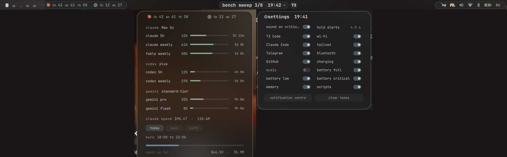
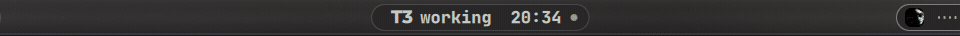
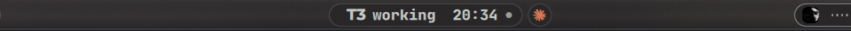
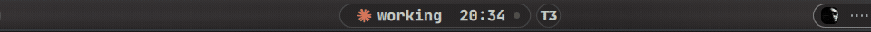
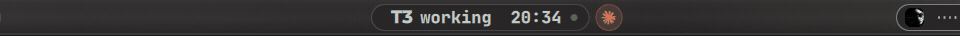
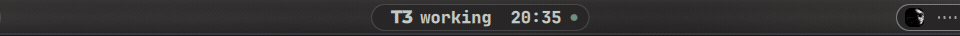
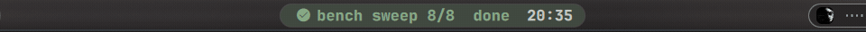
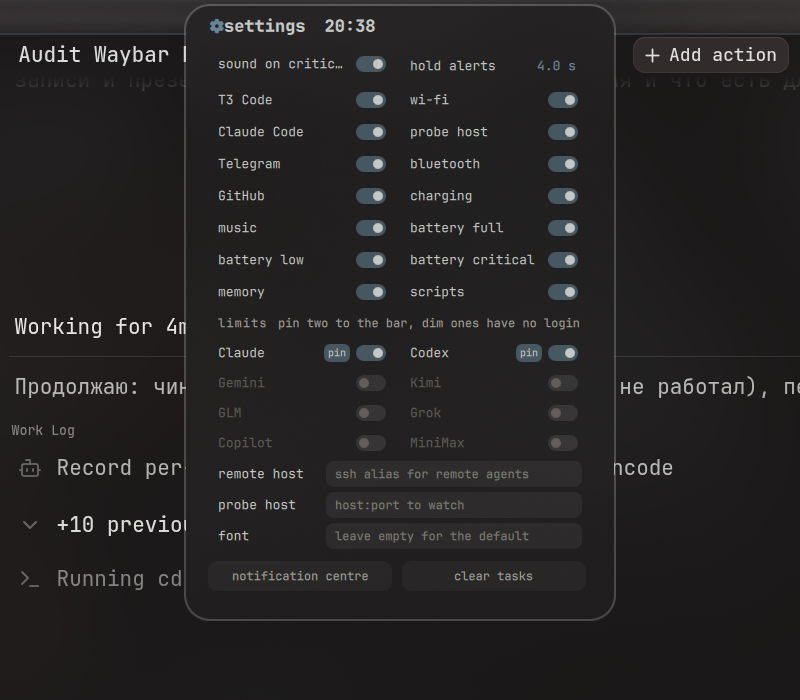

# Dynamic Bar

A top bar for Hyprland built around a Dynamic-Island-style pill. Runs as an
[Omarchy](https://omarchy.org) Quattro `bar` plugin or as a standalone
[Quickshell](https://quickshell.org) config.



| a second agent starts | click the bubble: swap |
|---|---|
|  |  |
| **it asks a question** | **it finishes** |
|  |  |
| **a task from a script** | **telegram, sender only** |
|  |  |

Panels: [limits](docs/media/panel-usage.mp4), [settings](docs/media/panel-settings.mp4),
[music](docs/media/music.mp4). A slide deck with all clips is in
[`docs/index.html`](docs/index.html).

What is on the bar, left to right:

- **Workspaces** with occupancy bars.
- **AI limits pill**: session and weekly percentages for your coding
  subscriptions. Click for the full panel: every window with reset countdown,
  Claude spend per day/week/month computed from local transcripts, and the
  current 5-hour burn rate.
- **The island**: shows what your coding agents are doing (Claude Code, Codex
  and T3 Code, local or on a remote host over ssh), long-running task progress, system
  alerts (battery, wifi, bluetooth, RAM, GitHub notifications, ntfy), Telegram
  senders, and the clock. A second agent lives in a satellite bubble. Click the
  pill for producer toggles, hover for the calendar. Drop files, images, links
  or text onto it to keep them on a shelf.
- **Music**: MPRIS now-playing with cover art (looked up on Deezer, iTunes,
  MusicBrainz or Yandex Music when the player gives none), seek, like, mute.
- **System pill**: RunCat CPU cat, RAM elephant, volume, wifi, bluetooth,
  battery, keyboard layout. Click for the panel: battery, power profiles,
  volume slider, wifi list with password entry, bluetooth devices and scanning.

## Requirements

- Hyprland 0.55 or newer (the Lua dispatcher API is used).
- Quickshell 0.3 or newer.
- `python3` (3.11+, standard library only).
- A Nerd Font. Omarchy's monospace alias is used when running as a plugin,
  `JetBrainsMono Nerd Font` standalone; set `font` in the config to override.

Optional tools, each feature turns itself off when its tool is missing (the
settings panel lists what is absent):

| tool | feature |
|---|---|
| `playerctl` | music pill |
| `ffmpeg`, `ffprobe` | cover art tiles and shelf thumbnails |
| `nmcli`, `bluetoothctl` | wifi and bluetooth alerts in the island |
| `gh` | GitHub notification alerts |
| `busctl` | Telegram sender alerts |
| `wl-copy`, `wl-paste` | shelf copy and paste |
| `ssh`, plus `sqlite3` and `jq` on the remote host | remote agent status |
| `codex` | Codex limits when the HTTP endpoint is unavailable |

No sudo, no package installs, no install hooks.

## Install as an Omarchy plugin

```sh
omarchy plugin add https://github.com/grechman/dynamic-bar.git --enable
```

Then pick it as the bar: `omarchy bar set` or edit `~/.config/omarchy/shell.json`
and set `"bar": { "id": "io.github.grechman.dynamic-bar" }`. The plugin starts its own
state daemon (`island.py`) inside the shell; nothing else needs to run. The
bar is top-only; `omarchy bar position` is ignored. The `bar-off` toggle is
respected.

Remove with `omarchy plugin remove io.github.grechman.dynamic-bar`. State lives in
`~/.cache/island`, config in `~/.config/island`; delete them if you want a clean
slate.

## Install standalone

```sh
git clone https://github.com/grechman/dynamic-bar.git ~/.config/quickshell/island
cp ~/.config/quickshell/island/systemd/*.service ~/.config/systemd/user/
systemctl --user daemon-reload
```

Add to `hyprland.conf`:

```
exec-once = ~/.config/quickshell/island/bin/island-autostart
```

or start it now with `~/.config/quickshell/island/bin/island-autostart`.
Restart the renderer after edits with `systemctl --user restart island-shell`.

## Agent status

Claude Code is tracked through its hook system. Install the hook into
`~/.claude/settings.json` explicitly (it edits that file, nothing else):

```sh
~/.config/quickshell/island/bin/island-claude-hook install
```

`uninstall` removes it again, `status` shows what is wired. Sessions driven
by T3 Code are skipped by the hook because T3 Code is tracked directly through
its own state database.

Codex is tracked the same way through its hooks (`hooks = true` in
`~/.codex/config.toml`). Wire `hooks/codex-action-state.py` yourself; the
plugin never edits that file:

```toml
[[hooks.SessionStart]]
[[hooks.SessionStart.hooks]]
type = "command"
command = "python3 /home/you/.config/quickshell/island/hooks/codex-action-state.py"
timeout = 10
```

Repeat the block for `UserPromptSubmit`, `PostToolUse`, `PermissionRequest`
and `Stop`. State files land in `~/.cache/island/codex/`.

For a remote machine set `"remote": "hostname"` in the config to an ssh alias
from your `~/.ssh/config` (key auth, no prompts). The same hook must be
installed there; `sqlite3` and `jq` must exist on the remote side.

## AI limits

Providers are detected from their own credential files; nothing is copied or
stored. Claude is the one exception to read-only access: when the Claude Code
sign-in has expired and no `claude` process is running, the plugin refreshes
the OAuth token itself and rewrites `~/.claude/.credentials.json` in place, so
the numbers stay live between sessions. All other tokens are never refreshed
or rewritten: when a sign-in expires the last numbers stay visible until their
window resets and the panel says what to run.

| provider | source |
|---|---|
| Claude | `~/.claude/.credentials.json` (Claude Code login) |
| Codex | `~/.codex/auth.json`, then `codex app-server`, then session logs |
| Gemini | `~/.gemini/oauth_creds.json` (Gemini CLI login) |
| Kimi | `~/.kimi-code/credentials/kimi-code.json` or `KIMI_CODE_API_KEY` |
| GLM / z.ai | `Z_AI_API_KEY`, or the BigModel keys and key files the GLM tools use |
| Grok | `~/.grok/auth.json` (grok login) |
| Copilot | `~/.config/github-copilot/apps.json` or `hosts.json` |
| MiniMax | `MINIMAX_API_KEY` (`MINIMAX_HOST` for the China host) |

On Omarchy, records written by `omarchy-agent-usage-update` under
`~/.local/state/omarchy/agents/usage/` are shown too, so any collector you add
there appears as a provider.

Claude and Codex are exercised daily. The other providers are implemented from
their documented endpoints and tested against recorded response shapes, not
against live accounts; open an issue with a redacted response if one misreads
your plan.

Config keys under `"usage"`: `"providers"` restricts the list (empty means
autodetect), `"pinned"` picks the two shown in the collapsed pill (empty means
the first two detected).

## Config

Click the island for the settings panel: every alert source is a switch, every
limits provider is a switch with a `pin` (two pinned providers make the bar
pill), and the remote host, probe host and font are text fields.



The file behind it is `~/.config/island/island.json`; see
`assets/island.example.json`. Keys:

| key | meaning |
|---|---|
| `sound` | play a sound on critical alerts |
| `seconds` | how long an alert stays |
| `font` | font family override |
| `remote` | ssh alias polled for remote agents, events and tasks |
| `probe_host` | `host:port` to TCP-probe every minute; two misses raise a "tailnet silent" alert |
| `producers` | per-source toggles, also flipped from the settings panel |
| `usage` | limits providers, see above |

Optional files in `~/.config/island/`:

- `ntfy-topic`: an ntfy.sh topic to mirror as alerts.
- `yandex-token`: Yandex Music OAuth token for likes and covers.
- `colors.css`: `@define-color` palette used when not running under Omarchy
  (Omarchy's current theme is used automatically; the bundled fallback is
  Kanagawa Dragon).

## Scripting the island

`bin/island-task start|progress|eta|dot|done|fail` drives a persistent task
pill from any shell. One-shot alerts are JSON files dropped into
`~/.cache/island/events/`:

```json
{"id": "deploy", "icon": "", "text": "deploy done", "severity": "good", "ttl": 5}
```

`bin/island-demo` plays a scripted tour of the states.

## Development

```sh
python3 -m unittest discover -s tests
qmllint -I "$OMARCHY_PATH/shell" *.qml
ISLAND_PREVIEW=1 ISLAND_DIR=~/.cache/island-dev qs -p .
```

`ISLAND_PREVIEW=1` anchors everything to the bottom edge so a development
copy can run next to the live bar; `ISLAND_DIR`, `ISLAND_CONFIG`,
`ISLAND_T3_DB`, `ISLAND_CLAUDE_DIR`, `ISLAND_REMOTE` and `ISLAND_COLORS`
redirect the daemon.

## License

GPL-3.0-or-later. The RunCat sprites in `assets/runcat/` come from
[gnome-runcat](https://github.com/win0err/gnome-runcat) (GPL-3.0). Provider
marks are drawn as monograms except the Claude and OpenAI glyphs, which belong
to their owners.
